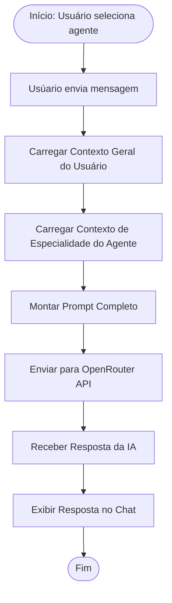

# ai-chat-agents

# Membros do Grupo:
### * Pedro Henrique Satoru Lima Takahashi RA: 22.123.019-6
### * Pedro Henrique Correia de Oliveira RA: 22.222.009-7
### * Hugo Emílio Nomura RA: 22.123.051-9
### * Vitor Monteiro Vianna RA: 22.223.085-6

## 2. Definição do Domínio do Sistema

**Qual é o domínio do sistema?** Assistentes Virtuais Inteligentes e Orquestração de Agentes de IA (LLMs).

**Qual problema real ele resolve?** Resolve a falta de especificidade e personalização dos chats de IA genéricos. O sistema permite que o usuário obtenha respostas mais precisas ao combinar automaticamente o contexto pessoal do usuário com o conhecimento especializado de um agente (ex: finanças, programação), sem a necessidade de criar prompts complexos manualmente a cada interação.

**Quem são os principais usuários?** Estudantes, profissionais e entusiastas de tecnologia que buscam produtividade e suporte especializado em áreas específicas (como finanças e TI).

## 3. Visão Geral do Sistema

**Nome do sistema:** AgentIA.

**Usuários principais:**
- Usuário Comum (pode consumir e criar agentes individuais).
- Usuário Administrador (cria e deleta qualquer agente globalmente).

**Principais funcionalidades (alto nível):**
- Chat interativo com seleção de agentes.
- Criação e edição de Agentes de IA personalizados (definição de especialidade).
- Gerenciamento de Contexto do Usuário (dados gerais que o chat deve sempre saber).
- Catálogo de Agentes Pré-definidos (Finanças e Programação).
- Integração via API (OpenRouter) para processamento das mensagens.

## 4. Identificação dos Processos de Negócio

Aqui estão os 3 processos principais baseados no fluxo que você descreveu:

### Processo 1: Envio e Processamento de Mensagem (Fluxo Principal)

**Entrada:** Mensagem de texto do usuário e Agente selecionado.  
**Saída:** Resposta gerada pela IA especializada.  
**Atores envolvidos:** Usuário.

### Processo 2: Criação de Novo Agente

**Entrada:** Nome do agente, descrição da especialidade (prompt do sistema) e configurações de tom/estilo.  
**Saída:** Novo agente disponível na lista de seleção do usuário.  
**Atores envolvidos:** Usuário, Administrador.

### Processo 3: Gerenciamento de Contexto Pessoal

**Entrada:** Informações sobre o usuário (ex: nível de conhecimento técnico, objetivos financeiros, preferências).  
**Saída:** Contexto geral atualizado e armazenado para injeção nos prompts.  
**Atores envolvidos:** Usuário.

## 5. Diagrama Simplificado de Processo

Abaixo, uma representação do fluxo principal (Processo 1) em formato de fluxograma textual (você pode desenhar isso usando caixas e setas):

**Snippet de código**

## 6. Preparação do Ambiente

- Linguagem, framework e Banco de Dados: 

  **Backend:** Python.  
  **Framework:** Sem framework, somente API's documentadas.  
  **Banco de Dados:** PostgreeSQL e DynamoDB.
