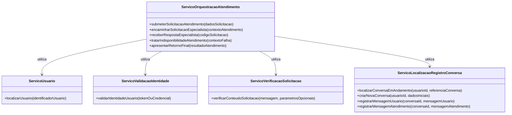

# Nome do Processo: Análise de Serviços
**Autores:** Pedro Henrique Satoru Lima Takahashi; Pedro Henrique Correia de Oliveira; Hugo Emilio Nomura; Vitor Monteiro Vianna  
**Data de emissão:** 09/04/2026  
**Revisor:** A definir  
**Data de revisão:** A definir

---

## Índice
1. [Objetivo do Documento](#objetivo-do-documento)
2. [Definição de Serviços Candidatos](#definição-de-serviços-candidatos)
    2.1 [Identificação de Operações Candidatas](#identificação-de-operações-candidatas)
    2.2 [Serviços Candidatos Identificados](#serviços-candidatos-identificados)
    2.3 [Descrição de Serviços](#descrição-de-serviços)

---

## Objetivo do Documento
Este documento tem como objetivo identificar operações candidatas a serviço a partir do processo TO-BE de atendimento de mensagem no chat, agrupar essas operações por entidade e contexto lógico e definir serviços com classificação em serviço de entidade, serviço de tarefa e serviço utilitário.

## Definição de Serviços Candidatos

### Identificação de Operações Candidatas

| Tarefa do Processo TO-BE | Operação Candidata |
| :--- | :--- |
| T01 - Enviar mensagem ao atendimento | submeterSolicitacaoAtendimento |
| T02 - Confirmar identificação do usuário | localizarUsuario, validarIdentidadeUsuario |
| T03 - Verificar dados mínimos da solicitação | verificarConteudoSolicitacao |
| T04 - Identificar conversa em andamento | localizarConversaEmAndamento, criarNovaConversa |
| T05 - Registrar solicitação no histórico | registrarMensagemUsuario |
| T06 - Encaminhar solicitação ao agente especializado | encaminharSolicitacaoEspecialista |
| T07 - Receber resposta do agente | receberRespostaEspecialista |
| T08 - Tratar indisponibilidade de atendimento | tratarIndisponibilidadeAtendimento |
| T09 - Registrar resposta no histórico | registrarMensagemAtendimento |
| T10 - Apresentar resposta ao usuário | apresentarRetornoFinal |

### Serviços Candidatos Identificados

As operações candidatas foram agrupadas por entidade e/ou contexto lógico do domínio.

| Contexto lógico / Entidade | Operações agrupadas | Serviço definido | Classificação |
| :--- | :--- | :--- | :--- |
| Usuário | localizarUsuario | ServicoUsuario | Serviço de entidade |
| Identidade e acesso | validarIdentidadeUsuario | ServicoValidacaoIdentidade | Serviço utilitário |
| Conversa e histórico | localizarConversaEmAndamento, criarNovaConversa, registrarMensagemUsuario, registrarMensagemAtendimento | ServicoLocalizacaoRegistroConversa | Serviço de entidade |
| Orquestração do atendimento | submeterSolicitacaoAtendimento, encaminharSolicitacaoEspecialista, receberRespostaEspecialista, tratarIndisponibilidadeAtendimento, apresentarRetornoFinal | ServicoOrquestracaoAtendimento | Serviço de tarefa |
| Qualidade dos dados da solicitação | verificarConteudoSolicitacao | ServicoVerificacaoSolicitacao | Serviço utilitário |

Representação em notação de classes UML dos serviços candidatos:

### Descrição de Serviços

#### Serviço: ServicoUsuario
**Classificação:** Serviço de entidade  
**Objetivo:** gerenciar dados de usuário necessários para o processo de atendimento.

**Operação:** localizarUsuario  
**Dados de entrada:** identificadorUsuario  
**Dados de saída:** usuarioLocalizado (id, statusCadastro), motivoNaoLocalizado (quando aplicável)  
**Descrição da lógica:**
1. Receber identificador informado na solicitação.
2. Consultar base de usuários cadastrados.
3. Verificar se existe usuário correspondente ao identificador.
4. Retornar dados do usuário quando localizado.
5. Retornar motivo de não localização quando não encontrado.

#### Serviço: ServicoValidacaoIdentidade
**Classificação:** Serviço utilitário  
**Objetivo:** validar credenciais de acesso do usuário ao atendimento.

**Operação:** validarIdentidadeUsuario  
**Dados de entrada:** tokenOuCredencial, identificadorCanal  
**Dados de saída:** usuarioValidado (id, status), motivoNegacao (quando aplicável)  
**Descrição da lógica:**
1. Receber credencial de identificação enviada na solicitação.
2. Verificar autenticidade e validade da credencial.
3. Confirmar se o usuário está apto a acessar o atendimento.
4. Retornar usuário validado em caso de sucesso.
5. Retornar motivo de bloqueio em caso de falha.

#### Serviço: ServicoVerificacaoSolicitacao
**Classificação:** Serviço utilitário  
**Objetivo:** verificar qualidade mínima da solicitação antes do processamento de atendimento.

**Operação:** verificarConteudoSolicitacao  
**Dados de entrada:** mensagem, parametrosOpcionais  
**Dados de saída:** solicitacaoVerificada (booleano), listaInconsistencias  
**Descrição da lógica:**
1. Receber conteúdo da solicitação e parâmetros associados.
2. Verificar se a mensagem possui conteúdo mínimo.
3. Verificar formato dos parâmetros opcionais.
4. Consolidar inconsistências encontradas.
5. Retornar resultado da verificação para decisão do fluxo.

#### Serviço: ServicoLocalizacaoRegistroConversa
**Classificação:** Serviço de entidade  
**Objetivo:** gerenciar ciclo de vida da conversa e histórico de interações do usuário.

**Operação:** localizarConversaEmAndamento  
**Dados de entrada:** usuarioId, referenciaConversa  
**Dados de saída:** conversaLocalizada (conversaId, status), encontrada (booleano)  
**Descrição da lógica:**
1. Receber identificação do usuário e referência de conversa.
2. Buscar conversa ativa vinculada ao usuário.
3. Verificar se a conversa localizada pertence ao usuário informado.
4. Retornar conversa encontrada quando existir.
5. Retornar indicador de não localização quando não existir conversa.

**Operação:** criarNovaConversa  
**Dados de entrada:** usuarioId, dadosIniciais  
**Dados de saída:** conversaCriada (conversaId, status, dataCriacao)  
**Descrição da lógica:**
1. Receber identificação do usuário e dados iniciais da conversa.
2. Gerar identificação única da nova conversa.
3. Inicializar estrutura de histórico da conversa.
4. Persistir nova conversa associada ao usuário.
5. Retornar dados da conversa criada.

**Operação:** registrarMensagemUsuario  
**Dados de entrada:** conversaId, mensagemUsuario, metadadosSolicitacao  
**Dados de saída:** registroMensagemUsuario (idRegistro, dataHora)  
**Descrição da lógica:**
1. Receber conversa alvo e conteúdo da mensagem do usuário.
2. Estruturar registro com metadados relevantes da solicitação.
3. Persistir registro no histórico da conversa.
4. Atualizar estado da conversa para "aguardando atendimento".
5. Retornar confirmação de registro.

**Operação:** registrarMensagemAtendimento  
**Dados de entrada:** conversaId, mensagemAtendimento, origemResposta  
**Dados de saída:** registroMensagemAtendimento (idRegistro, dataHora)  
**Descrição da lógica:**
1. Receber conversa alvo e conteúdo de resposta do atendimento.
2. Estruturar registro de resposta com origem e metadados.
3. Persistir resposta no histórico da conversa.
4. Atualizar estado da conversa para "respondida".
5. Retornar confirmação de registro.

#### Serviço: ServicoOrquestracaoAtendimento
**Classificação:** Serviço de tarefa  
**Objetivo:** orquestrar o processo completo de atendimento no chat, do recebimento da solicitação ao retorno final ao usuário.

**Operação:** submeterSolicitacaoAtendimento  
**Dados de entrada:** dadosSolicitacao (identificação, mensagem, referenciaConversa, parametros)  
**Dados de saída:** protocoloAtendimento, statusInicial  
**Descrição da lógica:**
1. Receber solicitação de atendimento do usuário.
2. Gerar protocolo interno da solicitação.
3. Encaminhar solicitação para verificação e validação.
4. Persistir status inicial da solicitação.
5. Retornar protocolo para rastreabilidade do fluxo.

**Operação:** encaminharSolicitacaoEspecialista  
**Dados de entrada:** contextoAtendimento (conversa, mensagem, perfilUsuario)  
**Dados de saída:** codigoSolicitacaoEspecialista, statusEncaminhamento  
**Descrição da lógica:**
1. Consolidar contexto necessário para análise.
2. Selecionar atendimento especializado adequado ao tema.
3. Encaminhar solicitação para processamento.
4. Registrar status de encaminhamento.
5. Retornar identificador para acompanhamento da resposta.

**Operação:** receberRespostaEspecialista  
**Dados de entrada:** codigoSolicitacao  
**Dados de saída:** respostaEspecialista (conteudo, statusAtendimento)  
**Descrição da lógica:**
1. Consultar resultado da solicitação encaminhada.
2. Verificar se houve resposta de atendimento.
3. Se houver resposta, estruturar conteúdo para consumo.
4. Se não houver resposta, sinalizar indisponibilidade.
5. Retornar resultado para etapa de decisão.

**Operação:** tratarIndisponibilidadeAtendimento  
**Dados de entrada:** contextoFalha (motivo, protocoloAtendimento)  
**Dados de saída:** retornoIndisponibilidade (mensagemUsuario, orientacaoNovaTentativa)  
**Descrição da lógica:**
1. Receber contexto da falha de atendimento.
2. Classificar tipo de indisponibilidade.
3. Preparar mensagem clara para o usuário.
4. Definir orientação de nova tentativa.
5. Retornar pacote de indisponibilidade para apresentação final.

**Operação:** apresentarRetornoFinal  
**Dados de entrada:** resultadoAtendimento (respostaEspecialista ou retornoIndisponibilidade)  
**Dados de saída:** retornoUsuario (mensagemFinal, statusConclusao)  
**Descrição da lógica:**
1. Receber resultado consolidado do processo.
2. Definir mensagem final de acordo com sucesso ou indisponibilidade.
3. Garantir consistência entre resposta e histórico registrado.
4. Entregar retorno final ao usuário.
5. Encerrar ciclo da solicitação.

---

**CENTRO UNIVERSITÁRIO FEI** Avenida Humberto de Alencar Castelo Branco, 3972, CEP: 09850-901 Sao Bernardo do Campo  
Telefone: (011) 4353-2900 Fax (011) 4109-5994  
Curso de Ciencias da Computacao  
**TPM_Analise de Servicos**