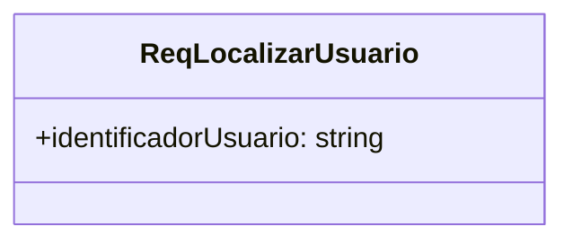
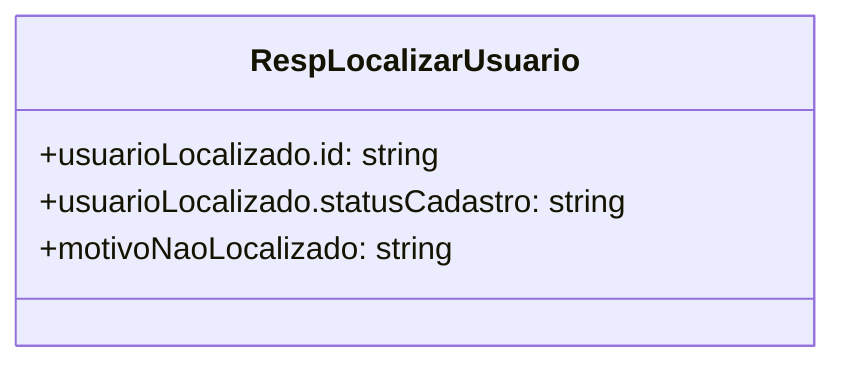
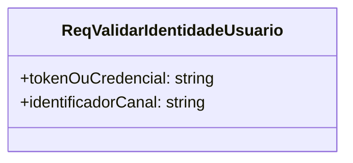
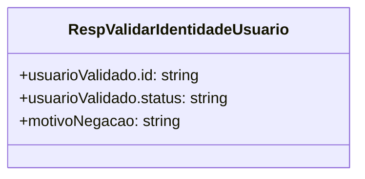
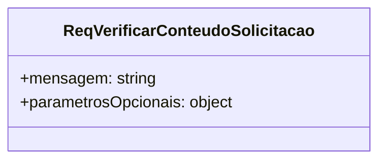
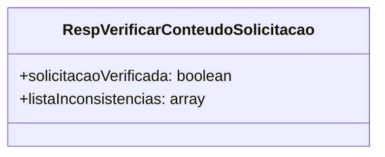
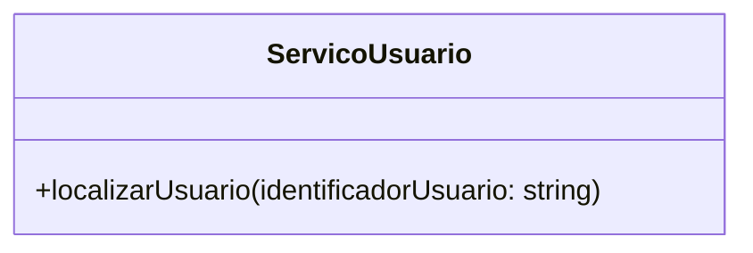
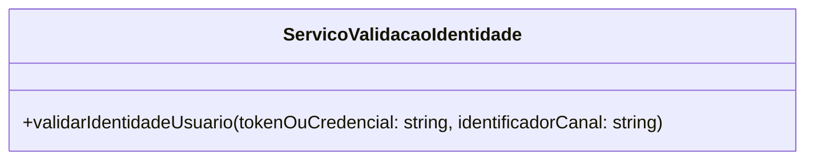
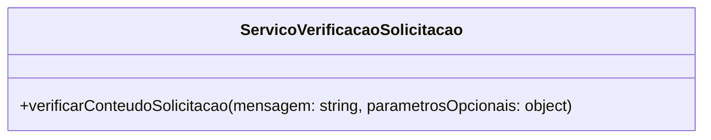

# Documento de Contratos de Servicos

## 1 Objetivo do Documento
O objetivo deste documento e descrever o design dos servicos, incluindo suas interfaces, esquemas de mensagens, politicas e acordos de nivel de servico (SLA), de forma a orientar sua implementacao e garantir a correta comunicacao entre eles.

Servicos considerados:
1. ServicoUsuario
2. ServicoValidacaoIdentidade
3. ServicoVerificacaoSolicitacao

Padrao de tipos de dados adotado:
1. string
2. boolean
3. integer
4. datetime (ISO 8601)
5. array<T>
6. object

## 2 Especificar os Esquemas de Mensagens dos Servicos
### 2.1 Mensagens do ServicoUsuario
## ReqLocalizarUsuario

## RespLocalizarUsuario

### 2.2 Mensagens do ServicoValidacaoIdentidade
## ReqValidarIdentidadeUsuario

## RespValidarIdentidadeUsuario

### 2.3 Mensagens do ServicoVerificacaoSolicitacao
## ReqVerificarConteudoSolicitacao

## RespVerificarConteudoSolicitacao

## 3 Especificar Interfaces dos Servicos
Neste topico, as interfaces dos servicos estao representadas em Mermaid, uma por servico.

### 3.1 Interface do ServicoUsuario

### 3.2 Interface do ServicoValidacaoIdentidade

### 3.3 Interface do ServicoVerificacaoSolicitacao

## 4 Especificar Politicas
Para cada servico, estao descritas regras de seguranca, autenticacao, autorizacao, controle de acesso e restricoes de uso.

### 4.1 ServicoUsuario
1. Requer autenticacao JWT valida.
2. Controle de acesso por escopo user:read.
3. Rate limit de 60 requisicoes por minuto por usuario.
4. Logs com mascaramento de dados sensiveis.
5. Retornar apenas campos minimos necessarios ao atendimento.

### 4.2 ServicoValidacaoIdentidade
1. JWT assinado e nao expirado.
2. Validacao de issuer e audience do token.
3. Bloqueio apos tentativas invalidas sucessivas.
4. Escopo minimo exigido: auth:validate.
5. Auditoria de autenticacao com trilha de eventos.

### 4.3 ServicoVerificacaoSolicitacao
1. Rejeitar mensagem vazia ou somente espacos.
2. Limite de tamanho da mensagem em 5000 caracteres.
3. Sanitizacao de conteudo e validacao de formato de parametros.
4. Regras de protecao contra payload malformado.
5. Erros padronizados para consumo por outros servicos.

## 5 Definir as SLA
Para cada servico, estao descritas metas de disponibilidade, tempo de resposta, capacidade e comportamento em caso de falhas.

### 5.1 ServicoUsuario
1. Disponibilidade mensal: 99,5%. V
2. Tempo de resposta: p95 <= 300 ms.
3. Capacidade: 200 requisicoes por segundo.
4. Falhas: timeout HTTP 504 e dependencia indisponivel HTTP 503.

### 5.2 ServicoValidacaoIdentidade
1. Disponibilidade mensal: 99,5%.
2. Tempo de resposta: p95 <= 200 ms.
3. Capacidade: 200 validacoes por segundo.
4. Falhas: HTTP 401, HTTP 403 e HTTP 503.

### 5.3 ServicoVerificacaoSolicitacao
1. Disponibilidade mensal: 99,5%.
2. Tempo de resposta: p95 <= 150 ms.
3. Capacidade: 200 validacoes por segundo.
4. Falhas: HTTP 422, HTTP 413 e HTTP 500.
