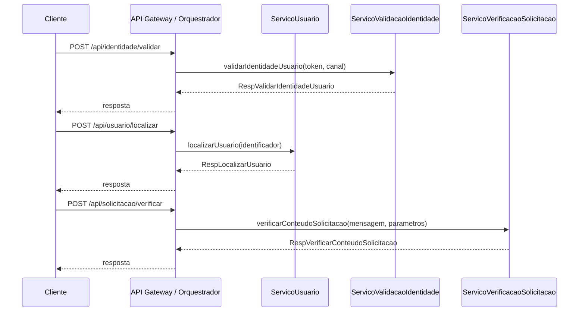

# Entrega — Serviços e Coordenação

## Objetivo
Implementar dois serviços em uma arquitetura orientada a serviços, definir o estilo de coordenação e elaborar estratégias de testes.

## Serviços implementados
- ServicoUsuario
- ServicoValidacaoIdentidade
- ServicoVerificacaoSolicitacao

## Estilo de coordenação
**Orquestração.** O serviço de API atua como orquestrador, recebendo a requisição, disparando as validações necessárias e retornando a resposta. Isso centraliza as regras de sequência, facilita auditoria e simplifica a evolução das políticas de segurança e validação.

## Diagrama de interação (Mermaid)

## Estratégia de testes
### Teste unitário
- Serviço escolhido: **ServicoValidacaoIdentidade**.
- Cenários: token inválido, bloqueio por tentativas consecutivas e validação bem-sucedida.
- Arquivo: tests/test_servicos_unit.py

### Teste de integração
- Fluxo entre dois serviços (orquestração): **ServicoValidacaoIdentidade** → **ServicoVerificacaoSolicitacao**.
- Complemento: comunicação HTTP com endpoints da API.
- Arquivo: tests/test_servicos_integration.py

## Evidências
- Incluir prints da execução dos testes (pytest) no documento final.

Tipo de Teste: Teste Unitário

Objetivo do Teste: Validar a lógica interna do `ServicoValidacaoIdentidade`, incluindo token inválido, bloqueio por tentativas consecutivas e validação bem-sucedida.
Técnica: Testes de caixa branca com asserções diretas nos métodos do serviço (arquivo tests/test_servicos_unit.py).
Critério de Finalização: Todos os cenários previstos passam sem falhas e cobrem os fluxos de negação e de validação.

Tipo de Teste: Teste de Integração

Objetivo do Teste: Validar a comunicação entre dois serviços (ServicoValidacaoIdentidade → ServicoVerificacaoSolicitacao) e a integração via HTTP com a API.
Técnica: Testes com fluxo orquestrado entre serviços e chamadas aos endpoints usando cliente HTTP (arquivo tests/test_servicos_integration.py).
Critério de Finalização: Fluxo entre serviços e endpoints retornam respostas esperadas (HTTP 200) e payloads válidos.
