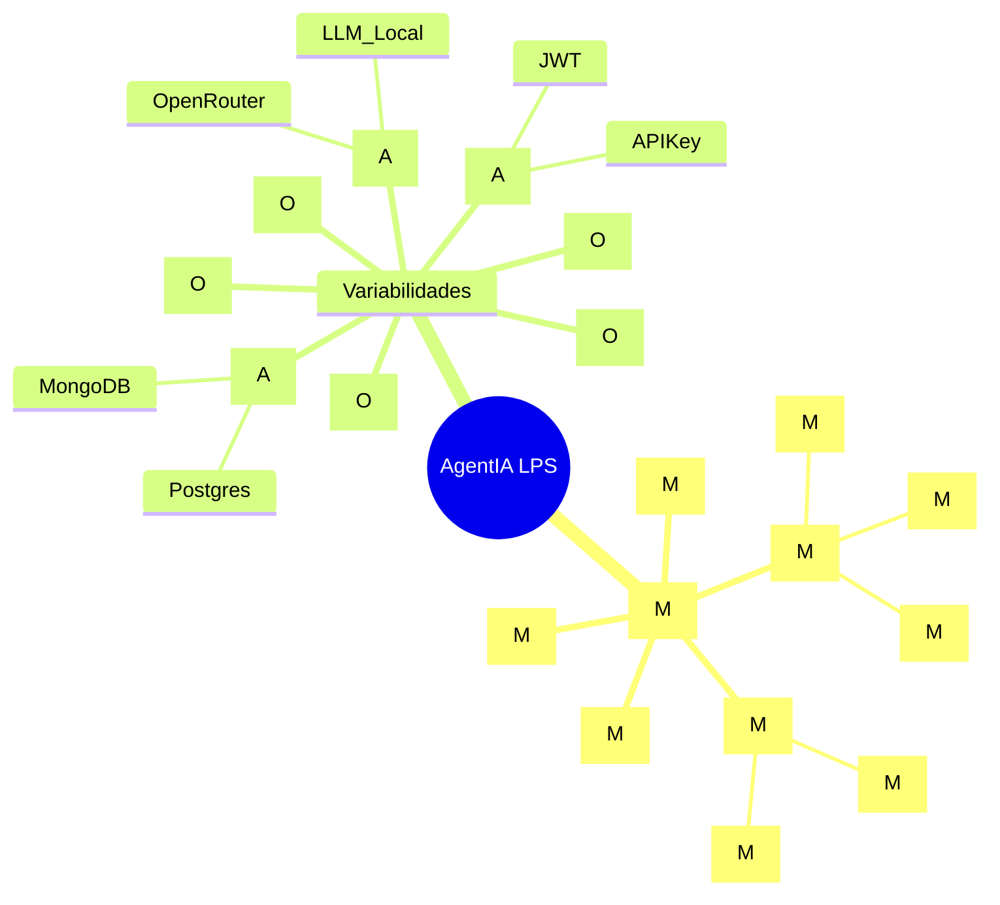
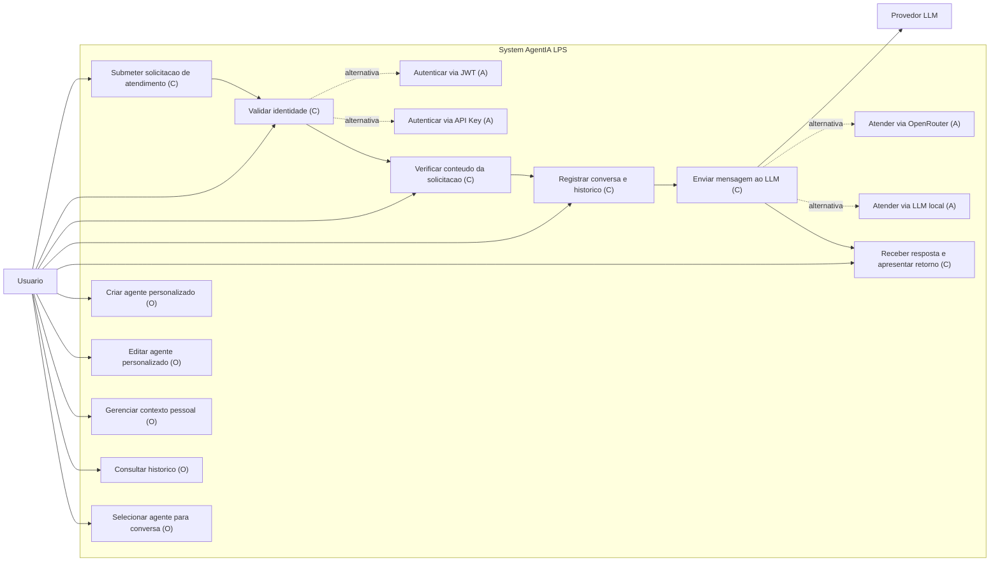

# TEMPLATE - LABORATORIO LPS

## Dominio do Sistema:
AgentIA - plataforma de atendimento conversacional com agentes especializados e integracao a LLM.

## Subdominios

| Subdominio | Responsabilidades | Tipo |
| --- | --- | --- |
| Atendimento Conversacional | Orquestrar atendimento, encaminhar solicitacao e consolidar resposta | Core |
| Identidade e Validacao | Localizar usuario, validar credencial e verificar solicitacao | Suporte |
| Conversa e Historico | Persistir conversas, registrar mensagens e recuperar historico | Generico |

## Requisitos da LPS (comum, opcional, alternativo)

| ID | Requisito | Tipo de Feature |
| --- | --- | --- |
| LPS-01 | Orquestrar o atendimento conversacional do inicio ao fim | Comum |
| LPS-02 | Validar identidade do usuario antes de processar a solicitacao | Comum |
| LPS-03 | Verificar conteudo minimo da solicitacao (mensagem e parametros) | Comum |
| LPS-04 | Registrar conversa e historico de mensagens | Comum |
| LPS-05 | Integrar com provedor de LLM para gerar respostas | Comum |
| LPS-06 | Expor API HTTP para consumo dos canais | Comum |
| LPS-07 | Gerenciar agentes personalizados (criar/editar) | Opcional |
| LPS-08 | Gerenciar contexto pessoal do usuario | Opcional |
| LPS-09 | Consultar historico completo da conversa | Opcional |
| LPS-10 | Suporte a multicanal (web e mobile) | Opcional |
| LPS-11 | Auditar eventos de autenticacao e validacao | Opcional |
| LPS-12 | Autenticacao via JWT ou API Key | Alternativo |
| LPS-13 | Provedor LLM OpenRouter ou LLM local/privado | Alternativo |
| LPS-14 | Persistencia de conversa em MongoDB ou Postgres | Alternativo |

## Modelo de Features

Legenda: [M] obrigatoria, [O] opcional, [A] alternativa (exclusiva)

## Diagrama de Casos de Uso

Legenda: (C) comum, (O) opcional, (A) alternativo

## Produtos da LPS

### Produto 1:
Basico (Atendimento Essencial)

**Features incluidas:**
- Core assets completos.
- Autenticacao JWT.
- Provedor LLM OpenRouter.
- Persistencia de conversa em MongoDB.

### Produto 2:
Premium (Atendimento Personalizado)

**Features incluidas:**
- Core assets completos.
- Autenticacao API Key.
- Provedor LLM local/privado.
- Persistencia de conversa em Postgres.
- Agentes personalizados.
- Contexto pessoal.
- Consulta historico.
- Multicanal (web e mobile).
- Auditoria de autenticacao e validacao.
