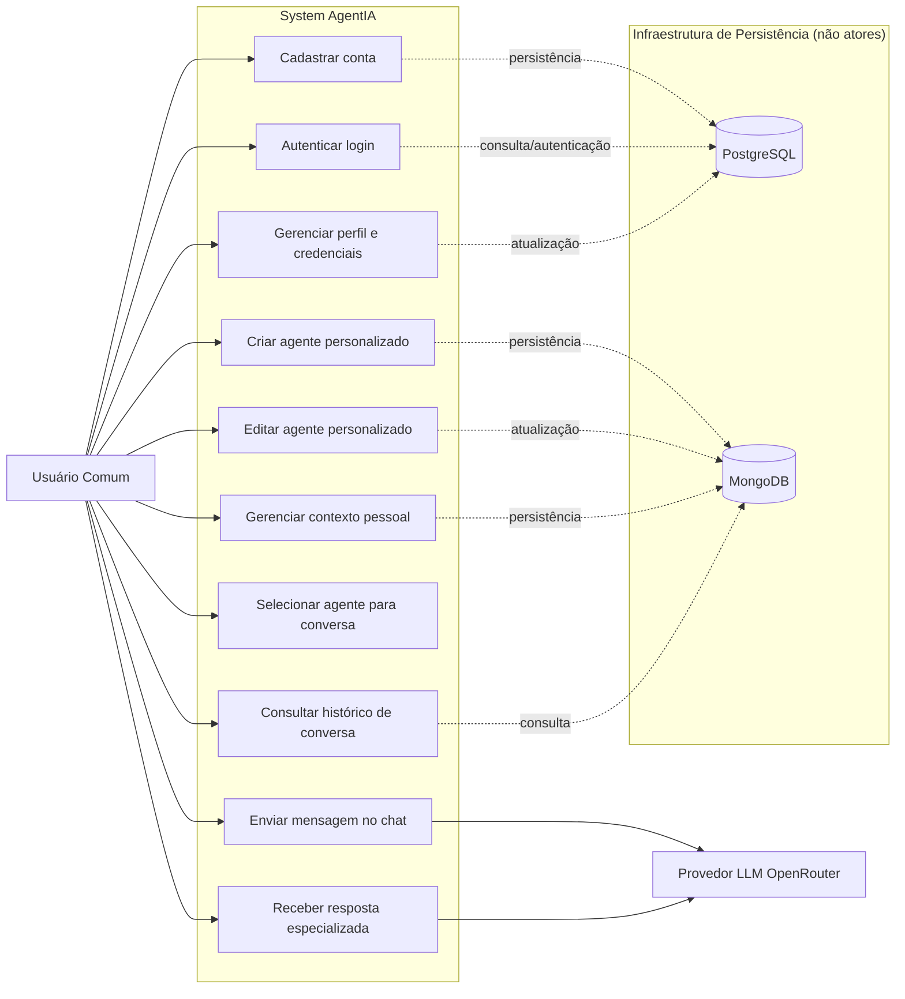

# AgentIA — Diagrama de Casos de Uso e Fluxos Principais

## 1. Visão Geral do Sistema

O AgentIA é uma plataforma de assistentes virtuais inteligentes com orquestração de agentes de IA especializados. O objetivo é permitir conversas mais precisas e personalizadas, combinando:
- contexto pessoal do usuário;
- especialidade do agente selecionado;
- processamento de mensagens via provedor de LLM.

## 2. Atores

- **Usuário Comum:** cria conta, configura preferências, cria agentes e conversa com a IA.
- **Provedor de LLM (OpenRouter):** processa prompts e retorna respostas geradas.

### 2.1 Infraestrutura de Persistência (não são atores)

- **PostgreSQL:** armazenamento de dados de identidade, autenticação e credenciais do usuário.
- **MongoDB:** armazenamento de agentes, contexto pessoal e histórico de conversas.

---

## 3. Diagrama de Casos de Uso



---

## 4. Detalhamento dos Fluxos Principais

## Fluxo 1 — Envio e Processamento de Mensagem

**Objetivo:** gerar uma resposta de IA contextualizada para a mensagem do usuário.

**Entrada:** mensagem do usuário, agente selecionado, parâmetros de geração e token de autenticação.  
**Saída:** resposta da IA, metadados de consumo e registro da interação.  
**Atores:** Usuário Comum e Provedor de LLM (OpenRouter).

### Passo a passo
1. Usuário seleciona o agente e envia a mensagem no chat.
2. Sistema autentica o usuário e valida os dados da requisição.
3. Sistema recupera contexto pessoal do usuário.
4. Sistema recupera a definição de especialidade do agente.
5. Sistema monta o prompt final (contexto + especialidade + mensagem atual).
6. Sistema envia o prompt ao provedor de LLM.
7. Sistema recebe a resposta, registra histórico e retorna o resultado ao usuário.

### Fluxos de Exceção

**Exceção 1.1 — Falha de autenticação**
1. Sistema identifica token inválido, expirado ou ausente.
2. Sistema interrompe o processamento da mensagem.
3. Sistema retorna erro de autenticação ao usuário.

**Exceção 1.2 — Indisponibilidade do OpenRouter**
1. Sistema envia requisição ao provedor de LLM.
2. OpenRouter retorna erro ou indisponibilidade de serviço.
3. Sistema registra falha técnica e retorna erro de integração ao usuário.

---

## Fluxo 2 — Criação de Novo Agente

**Objetivo:** permitir a criação de agentes especializados reutilizáveis.

**Entrada:** nome do agente, descrição da especialidade, tom e estilo de resposta.  
**Saída:** agente criado e disponível para seleção no chat.  
**Atores:** Usuário Comum.

### Passo a passo
1. Usuário acessa a funcionalidade de criação de agente.
2. Sistema recebe e valida os campos obrigatórios.
3. Sistema aplica regras de negócio (unicidade de nome por usuário, limites de tamanho e formato).
4. Sistema persiste o agente.
5. Sistema confirma o cadastro e disponibiliza o agente no catálogo.

### Fluxos de Exceção

**Exceção 2.1 — Dados obrigatórios inválidos**
1. Sistema valida os campos de criação do agente.
2. Sistema identifica ausência ou formato inválido de dados.
3. Sistema interrompe o cadastro e retorna mensagem de validação.

**Exceção 2.2 — Nome de agente duplicado**
1. Sistema verifica unicidade do nome para o mesmo usuário.
2. Sistema encontra agente já existente com o mesmo nome.
3. Sistema rejeita a criação e solicita outro nome.

---

## Fluxo 3 — Gerenciamento de Contexto Pessoal

**Objetivo:** manter informações persistentes para personalizar respostas futuras.

**Entrada:** preferências de comunicação, nível técnico, objetivos e instruções permanentes.  
**Saída:** contexto pessoal atualizado e pronto para uso no processamento de mensagens.  
**Atores:** Usuário Comum.

### Passo a passo
1. Usuário cria ou atualiza seu contexto pessoal.
2. Sistema valida formato, tamanho e conteúdo permitido.
3. Sistema salva o contexto em armazenamento persistente.
4. Em cada nova conversa, sistema recupera o contexto automaticamente.
5. Sistema incorpora o contexto no prompt antes da chamada ao modelo.

### Fluxos de Exceção

**Exceção 3.1 — Conteúdo inválido ou acima do limite**
1. Sistema valida tamanho e formato do contexto enviado.
2. Sistema identifica conteúdo fora das regras.
3. Sistema bloqueia a atualização e retorna erro de validação.

---

## 5. Interfaces dos Três Fluxos Principais

```text
<<interface>>
MensagemService
----------------------------------------
+ enviarMensagem(usuario_id: int, agente_id: str, mensagem: str, modelo: str, max_tokens: int, temperature: float) -> dict
+ consultarHistorico(usuario_id: int, chat_id: str) -> list[dict]
+ listarChats(usuario_id: int) -> list[dict]
+ deletarChat(usuario_id: int, chat_id: str) -> bool

<<interface>>
AgenteService
----------------------------------------
+ criarAgente(usuario_id: int, nome: str, especialidade: str, tom: str, estilo: str) -> dict
+ editarAgente(usuario_id: int, agente_id: str, nome: str | None, especialidade: str | None, tom: str | None, estilo: str | None) -> dict
+ buscarAgentePorId(usuario_id: int, agente_id: str) -> dict
+ listarAgentes(usuario_id: int) -> list[dict]
+ deletarAgente(usuario_id: int, agente_id: str) -> bool

<<interface>>
ContextoPessoalService
----------------------------------------
+ criarContexto(usuario_id: int, preferencias: str, nivel_tecnico: str, objetivos: str, instrucoes_permanentes: str) -> dict
+ atualizarContexto(usuario_id: int, preferencias: str | None, nivel_tecnico: str | None, objetivos: str | None, instrucoes_permanentes: str | None) -> dict
+ buscarContexto(usuario_id: int) -> dict
+ deletarContexto(usuario_id: int) -> bool
```
